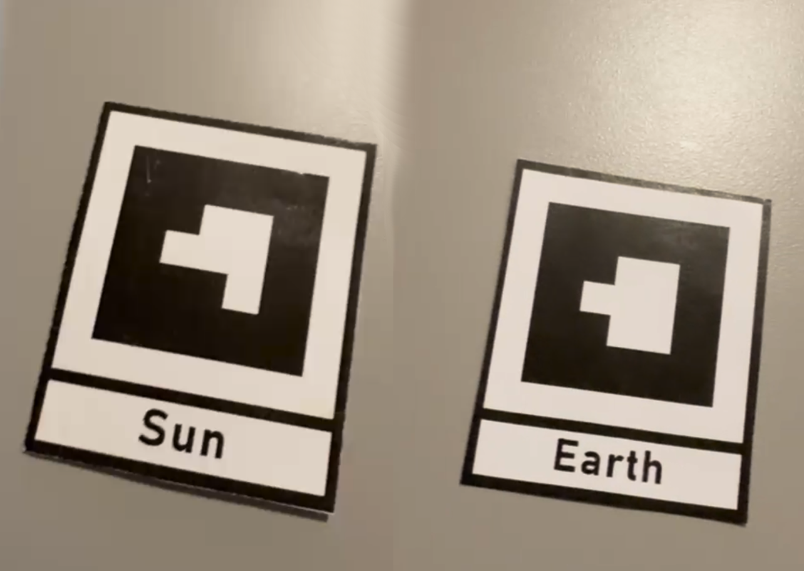
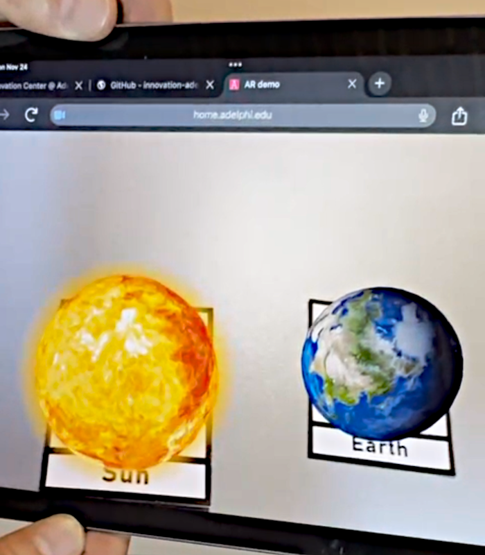

# ar-marker
A web-based augmented reality application that uses a device camera and positions a 3D model on top of an AR marker.

The AR marker images used by this application are available in the <code>markers</code> directory.

  

